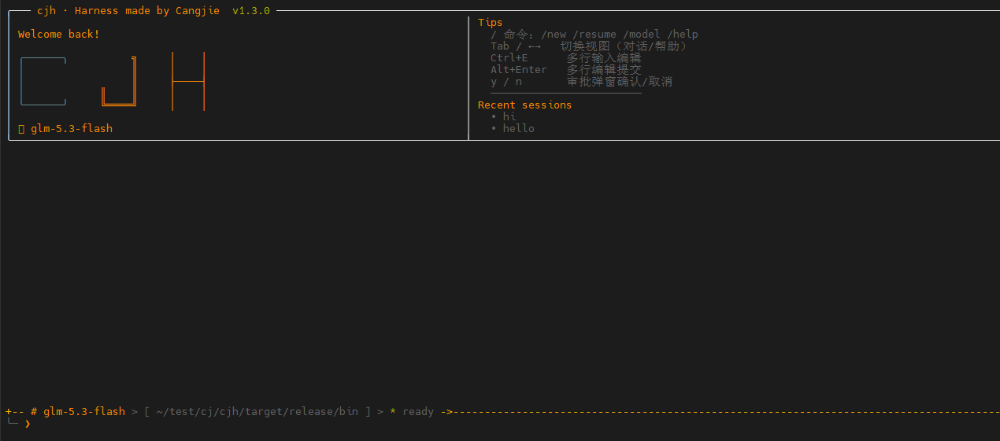
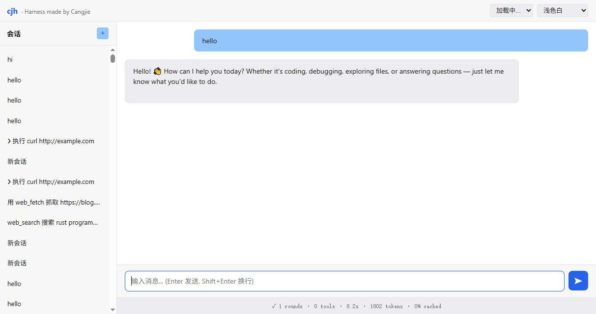

<div align="center">

# cjh · 仓颉语言实现的 Harness

**用华为仓颉语言从零实现的交互式编码代理（coding agent harness）。**

终端里用自然语言描述任务 → Agent 理解意图、自主规划、调用工具、观察结果、迭代直至完成。全流程在 TUI 中实时呈现，亦可通过 Web 远程驱动。

**cjh 是仓颉语言原生实现的 coding agent harness**：单二进制零依赖分发（一个文件 = 一个 agent）、语言级内存安全加持的插件信任链、以「省 token + 高执行效率」为双硬性指标的系统化工程优化。终端 TUI 与 Web 远程双驱动，并面向 **agent 集群调度** 演进——从单个工程师到软件工程团队级并行。

[立项初衷](#-立项初衷不是再造一个-agent) · [功能](#-功能一览) · [两大硬性指标](#-两大硬性指标) · [快速开始](#-快速开始) · [架构](#-架构) · [插件生态](#-插件生态与信任链) · [文档](#-文档) · [路线图](#-路线图)

</div>

---

## 🎯 立项初衷：不是再造一个 agent

> AI 编程 agent 领域已有 codex、claude code、deepseek dsh、pi、omp 等成熟方案，功能层面已被充分验证。
> **再造一个「用仓颉实现的同类 agent」没有价值。** cjh 的立身之本，是仓颉语言特性带来的差异化：
> 单二进制分发、强安全 DNA、多后端编译、M:N 原生并发，以及由此支撑的 **agent 集群调度**。

立项核心命题：**主流 agent 已证明功能可行，功能堆砌无意义；仓颉独有优势才是立身之本。** 三个硬约束贯穿全部设计：

1. **不重复造轮子**：功能层面主流 agent 已证明可行，功能堆砌无意义；
2. **仓颉独有优势是前提**：别的语言能轻易做到的，不构成竞争力；取长补短，好的当然可以借鉴，但仓颉语言特性带来的差异化更值得做；
3. **生态贡献是目标**：像 dsh 的插件生态一样，让社区愿意为 cjh 贡献——这要求插件门槛足够低、分发足够顺、信任机制足够完善。

### 仓颉语言特性如何命中痛点

仓颉语言的特性恰好命中上述痛点中的 4 个。这是"为什么是仓颉"而非"顺便用仓颉"：

| 仓颉特性 | 解决的痛点 | 差异化优势 |
|---|---|---|
| **静态编译单二进制**（cjnative） | 运行时包袱、分发成本 | 无 Node/Bun/npm 依赖树，`一个文件 = 一个 agent`，<10MB |
| **强安全语言设计**（安全 DNA） | 安全模型 | 插件/技能编译期类型检查，内存安全，恶意代码风险结构性降低 |
| **多后端编译 + 终端层平台抽象**（cjnative/cjvm + 鸿蒙位） | 平台覆盖 | Linux / macOS / Windows 原生运行，鸿蒙预留；终端层 VT 输出统一 + 平台后端条件编译，一份源码多平台二进制（[方案](docs/跨平台终端层设计方案.md)） |
| **M:N 轻量线程 + 高性能** | 上下文管理、并发 | 原生并发处理流式/多 agent，低开销 |
| **国产根技术** | 信创/自主可控 | 政企、金融等敏感场景无涉外运行时依赖 |

### cjh 的差异化

面对主流 agent 的成熟方案，cjh 的差异化优势体现在：

**1. 仓颉单二进制 → 插件零依赖、分发即用**

dsh 的插件生态强大，但 Node/npm 依赖树是隐形门槛。cjh 用仓颉单二进制：插件 = 一个 shell 脚本或一个仓颉包，无运行时环境配置，`git clone` 即用。门槛降到最低，社区贡献意愿才最高。

**2. 仓颉强安全 DNA → 插件安全结构性提升**

主流 agent 的插件安全靠沙箱+审批（运行时拦截），cjh 借助仓颉编译期类型检查+内存安全，从语言层面降低恶意代码风险。叠加 SHA256 校验和 + SM2 国密签名验证（仓颉 `stdx.crypto` 原生），形成"语言层安全 + 信任链安全"双保险。

**3. 省 token + 高执行效率 → 双硬性指标全面优化**

这是 cjh 区别于"功能堆砌"的核心。参考 Pi 的省 token 工程化与 OMP 的 hashline 文件改写等成熟经验，结合仓颉语言特性做系统性优化。详见下方[两大硬性指标](#-两大硬性指标)章节。

**4. 终极目标：agent 集群调度（从"单个工程师"到"软件工程团队"）**

对标 pi/omp 只是起点——参考众多 agent 的优点，是为了**提高单个 agent 的能力**（省 token、运行效率）；
而 cjh 借助仓颉语言特性真正要做的，是 **agent 集群调度**，把单 agent 能力放大为团队级并行。

单个 agent 能力再强，本质上只是一个工程师——**一次只能专注一件事**：正在跑测试用例就无法同时改代码。
而大型复杂项目从来不是单人工程：项目经理、需求分析师、开发、美工、测试……分工协作、并行推进。

**cjh 的终极形态是 agent 集群**：一个总 agent 作为"项目经理"协调调度，按需 fork 出多个子 agent——
各自独立的工作空间与上下文（类 Linux fork：空间独立、互不干扰）、明确的任务契约（接口定义）、
并行执行自己的活，最终汇总交付；亦可按用途任意编排 agent 工作流，各 agent 独立配置模型与能力。

| 维度 | 单 agent | agent 集群（cjh 终极形态） |
|---|---|---|
| **并行能力** | 一次干一件事（跑测试就不能改代码） | 测试 / 编码 / 审查 / 文档并行推进 |
| **上下文开销** | 每 agent 全局记忆，token 随规模爆炸 | 子 agent 只需任务局部记忆，**按任务隔离上下文，省 token** |
| **模块化** | 一次对话线性推进 | 契约化接口 → 模块化开发，可任意编排工作流 |
| **模型配置** | 单一模型 | 各 agent 按角色配模型（探索用快模型、编码用强模型、审查用专门模型） |

仓颉 **M:N 轻量线程**是 agent 集群的原生支撑：子 agent 即进程内线程，调度零额外开销；
**静态单二进制**让整个集群就是一个文件——自研、可控、轻量，远优于集成三方差质量 agent 的拼盘。

## 🌟 为什么是 cjh

| | |
|---|---|
| **仓颉原生的 Coding Agent Harness** | 从 Agent 核心、工具系统、TUI 渲染到 Web Server，全部用仓颉语言实现，是仓颉生态在 AI 编程领域的旗舰实践。 |
| **单二进制 · 零运行时依赖** | 仓颉 `cjnative` 静态编译，一个二进制跑起来，无需 Python/Node 环境。 |
| **省 token + 高执行效率** | 借鉴 Pi 的省 token 工程化（工具结果截断与回溯、自动 Compaction、prompt cache 利用），借鉴 OMP 的 hashline 文件改写（精确行级编辑、避免整文件重写），两大硬性指标全面优化。 |
| **多 Provider 开箱即用** | OpenAI / DeepSeek / GLM / Anthropic / Ollama 全兼容，`/provider` 热切换。 |
| **插件信任链** | SHA256 校验和 + SM2 国密签名验证（仓颉 `stdx.crypto` 原生），防供应链投毒。 |
| **Web 原生支持** | 内置 HTTP Server + WebSocket 流式对话 + REST API + 前端 SPA，远程驱动 Agent。 |
| **跨平台原生** | 仓颉多后端编译 + 终端层平台抽象（POSIX/Win32 后端条件编译，VT 输出统一），一份源码出多平台二进制，单文件分发不变（[方案](docs/跨平台终端层设计方案.md)，规划中）。 |

## 🎯 两大硬性指标

cjh 的核心设计目标是两大硬性指标：**省 token** + **高执行效率**。这两点直接决定 coding agent 的实用价值与成本。

### 指标一：省 token

LLM API 按 token 计费，coding agent 多轮工具调用累积 token 消耗惊人。cjh 参考 [Pi agent 的省 token 工程化](docs/pi%20agent的核心卖点.md) 的经验，从四个维度系统优化：

| 优化手段 | 实现方式 | 效果 |
|---|---|---|
| **工具结果截断与回溯** | 超阈值工具结果保留头尾 + **完整落盘** `~/.cjh/spill/<sessionId>/<toolCallId>.txt` + 省略标记含落盘路径，模型可用 `read_file` 按需读回 | 避免像某些 agent（如 d'sh）只取开头和结尾丢失中间信息；落盘回溯既省 token 又不丢信息 |
| **自动 Compaction** | 消息条数或估算 token 超阈值触发 LLM 摘要压缩早期历史，`compactThreshold` / `compact_token_threshold` / `compactKeep` 可配 | 长会话不爆上下文窗口，省 token 又防溢出 |
| **prompt cache 利用** | DeepSeek `prompt_cache_hit_tokens` + Anthropic `cache_read_input_tokens` 统计与展示 | 利用 Provider 的 prompt 缓存，重复前缀不重复计费 |
| **回合总结条** | 每轮结束显示 `✓ 2 rounds · 3 tools · 42.6s · 1.53K tokens · 99% cached` | token 消耗实时可见，便于人工干预 |

**工具结果截断与回溯的精妙设计**：不同于简单截断（只保留前 N 行），cjh 采用 **头尾保留 + 中间落盘** 策略。模型看到结果的开头和结尾（保留上下文连贯性），中间完整内容落盘到 `~/.cjh/spill/`，省略标记中包含落盘路径。当模型需要中间信息时，可用 `read_file` 按需读回。这样既大幅省 token，又不丢失任何信息——**这是 cjh 区别于简单截断 agent 的核心设计**。

工具差异化阈值（避免一刀切）：
- `bash`：2000 字符（激进截断——bash 输出常占 prompt 大头，完整结果落盘可回溯）
- `list_dir`：4000 字符
- 默认：6000 字符

### 指标二：高执行效率

coding agent 的执行效率直接决定用户等待时间。cjh 从三个维度优化：

| 优化手段 | 实现方式 | 效果 |
|---|---|---|
| **V2d 并发执行引擎** | DAG 依赖分析（从 `ToolCall` 提取资源访问 `(path, isWrite)`）+ 拓扑分组调度（同组 spawn 并发，组间串行） | LLM 并行工具调用自动并发执行，`parallelSavedMs` 实时统计节省时间 |
| **hashline 文件改写**（借鉴 OMP） | 行号锚点 `@@N` + 内容验证编辑，避免 read 整文件 + write 整文件的开销 | 大文件精确行级编辑，省 token 又快 |
| **Provider 连接预热** | 构造时后台建连，首次 `chatStream` 不付 TLS 冷启动开销 | 首次响应更快 |

**V2d 并发引擎的 DAG 依赖分析**：每个工具调用提取资源访问 `(path, isWrite)`，自动构建依赖图。规则：
- 同一 path 且至少一个 isWrite → 串行依赖边
- 不同 path → 可并发（即使都是 write）
- `bash` 的 command 当 path 处理（不同 bash 命令可并发）

拓扑分组调度：按依赖关系分组，同一组的工具调用可并发执行；下一组必须等当前组全部完成。组内顺序保持 LLM 原始顺序（结果回填顺序）。单元素组直接串行执行（避免 spawn 开销）；多元素组 spawn 并发。

性能基线测量三维统计：
- `parallelBatches`：并发执行的批次数
- `parallelSavedMs`：并发相比串行节省的毫秒数
- `maxParallelism`：最大并发度（单组最多工具数）

### 📊 实测基准（2026-08-29，真实 LLM 任务）

> 任务：优化 shooter HTML 小游戏（deepseek-v4-flash），对比优化前后同一任务 240-300s 窗口数据。

| 指标 | 优化前 | 优化后 | 说明 |
|---|---|---|---|
| prompt 峰值 | 42.9K token（无上限爬升） | **9.4K**（压缩后重置 5-7K） | 历史压缩机制修复（见下） |
| 同窗口轮次 | 48 轮 / 300s | 15 轮 / 240s | 单轮耗时降为 2-5s（此前 5-22s） |
| 压缩触发 | 从不触发 | 每 ~5 轮自动压缩 | 双阈值：消息条数 OR 真实 prompt token |
| 工具执行耗时 | <100ms | <100ms | 框架本身非瓶颈（实测） |
| 并行工具批 | 偶发 | 实测 3 路并行 read_file | V2d DAG 引擎 |

**历史压缩机制的三次迭代修复**（`docs/疑难问题-LLM工具调用效率低.md`）：
1. 压缩检查从 `run()` 开头移入**每轮循环**——原实现单次任务几十轮内从不复查
2. 触发信号用 provider 返回的**真实 `usage.promptTokens`**——字符估算实测 7x 低估
3. `compactKeep` 12→6——否则压缩删不掉足够消息、prompt 无法重置

## 📸 界面预览

### TUI 终端界面



全屏 TUI：彩色 logo + 标题栏 + 对话/帮助视图标签 + 可滚动输出区（Markdown 渲染、流式增量、工具调用提示、回合总结条）+ 状态栏 + 输入框（`/` 命令下拉补全、Ctrl+E 多行编辑）。

### Web 远程界面



内置 HTTP Server + WebSocket 流式对话 + REST API + 前端 SPA，浏览器远程驱动 Agent，与 TUI 共享同一套工具/插件/MCP 体系。

---

## 🚀 功能一览

### Agent 核心

- **多轮工具调用循环**：消息历史 → LLM → 工具调用 → 结果回填 → 再调用，支持复杂任务编排
- **三域 Capability 安全模型**：commands / tools / resources 白名单 + 危险操作审批链
- **自动 Compaction**：消息条数或估算 prompt token（真实 `usage.promptTokens`）超阈值自动 LLM 摘要压缩早期历史，`compactThreshold` / `compact_token_threshold` / `compactKeep` 可配
- **项目指令**：自动加载 `AGENTS.md` / `.atomcode.md` 项目指令注入 system prompt

### 工具系统（14 个内置 + 可扩展）

| 工具 | 说明 |
|---|---|
| `bash` | 执行 shell 命令，捕获 stdout/stderr |
| `read_file` | 读取文件，大文件返回符号摘要，offset/limit 按需展开 |
| `write_file` | 写入文件（创建/覆盖） |
| `hashline_edit` | 行号锚点 `@@N` + 内容验证编辑（借鉴 OMP） |
| `edit` | str_replace 精确替换，old_string 必须唯一（或 replace_all=true） |
| `grep` | 目录树递归搜索，gitignore 感知 |
| `glob` | 文件名模式匹配，支持 `**` 跨目录（借鉴 OMP） |
| `ast_grep` | AST 结构搜索，调 ast-grep CLI（sg），降级 grep |
| `list_dir` | 列出目录树 |
| `append_file` | 追加写入文件，OpenMode.Append 增量写 |
| `todo_write` | LLM 通过工具调用管理任务列表 |
| `task` | 派发子代理执行独立任务，explore（只读）/ worker（可写）——V4 将升级为集群编排的基础原语 |
| `web_search` | 联网搜索，多后端路由（Tavily/Exa/SearXNG/DDG）+ per-engine key rotation |
| `web_fetch` | 抓取网页，三级降级链（仓颉 HTTP → curl → Firecrawl）+ SSRF 防护 |

### LLM Provider 层

| Provider | 协议 | 说明 |
|---|---|---|
| **OpenAI** | OpenAI API | GPT-4o / GPT-4o-mini |
| **DeepSeek** | OpenAI 兼容 | deepseek-chat / deepseek-v4-flash，支持 prompt_cache_hit_tokens |
| **GLM** | OpenAI 兼容 | glm-4-flash，智谱 AI |
| **Ollama** | OpenAI 兼容（无 TLS） | 本地模型，apiKey 可空 |
| **Anthropic** | Anthropic API | Claude 系列，支持 cache_read_input_tokens |
| **MCP 服务器** | MCP 协议（stdio） | 通过 `mcp_servers` 配置接入，工具自动注册 |

- **SSE 流式解析**：逐块读取、UTF-8 安全切分、事件帧回调
- **流式累加器**：增量文本实时上屏（差分渲染逐帧刷新）
- **Provider 热切换**：`/model` `/provider` 运行时切换，历史保留

### TUI 终端界面

- **全屏 TUI**：差分渲染 + ANSI 转义，termios 原始模式（纯 libc FFI，自实现非依赖第三方库）
- **Markdown 渲染**：标题 / 列表 / 代码块 / 表格 / 链接
- **6 套主题**：starfrost（星霜青）/ classic / catppuccin / rose-pine / solarized / monokai，`/theme` 实时切换
- **多行编辑器**：Ctrl+E 进入，Alt+Enter 提交
- **斜杠命令补全**：`/` 触发下拉补全
- **Tasks 面板**：Agent 内置任务列表实时展示
- **回合总结条**：`✓ 2 rounds · 3 tools · 42.6s · 1.53K tokens · 99% cached`
- **审批弹窗**：危险操作内嵌 y/n 审批
- **欢迎视图**：两栏布局（logo+模型 / Tips+会话）

### Web 支持（v1.3.0）

- **HTTP Server**：静态资源 + REST API + WebSocket
- **WebSocket 流式对话**：`ChatRequest` → `tool_start` → `tool_result` → 流式 `delta` → `done`
- **REST API**：sessions / models / tasks / health
- **前端 SPA**：原生 JS + marked.js + DOMPurify + highlight.js，6 套主题
- **auth_token 鉴权中间件** + **启动安全审计日志**

### 会话与记忆

- **树形会话**：会话分支/fork，parent 链追踪，`/tree` 树形列示
- **会话恢复**：`--resume <id>` 恢复历史会话
- **会话列表**：`--list` 列出所有会话
- **自动 Compaction**：消息超阈值自动 LLM 摘要压缩
- **工具结果截断与回溯**：超阈值结果保留头尾 + 完整落盘 `~/.cjh/spill/` + 省略标记含落盘路径

### 技能系统

- **技能即 Markdown**：`~/.cjh/skills/<name>.md`，frontmatter 声明元数据 + 工具
- **技能白名单**：`enabled_skills` 配置启用技能
- **技能携带工具**：技能 frontmatter 的 `tools` 段注册声明式工具

### 无头模式

- **JSON 模式**：`--mode json` 无头模式，输出 JSON 结果（脚本可解析）
- **CLI 模式**：`--cli` 命令行交互模式
- **Mock 模式**：`--mock` 验证模式，使用 MockProvider，无 API Key 也能测

## 🔧 快速开始

### 环境要求

- 仓颉 SDK 1.0.5+（`cjc` / `cjpm`）
- stdx 扩展标准库
- Linux（本项目纯终端，无 GUI 依赖）

### 构建

```bash
# 激活仓颉环境
source /path/to/cj-env.sh

# 构建（产物为 cjh）
cjpm build
```

### 配置

```bash
# 设置 API Key（任选一种）
export OPENAI_API_KEY=sk-xxx        # OpenAI
export DEEPSEEK_API_KEY=sk-xxx      # DeepSeek
export DASHSCOPE_API_KEY=sk-xxx     # 通义千问
export CJH_API_KEY=sk-xxx           # 通用

# 可选：指定端点和模型
export CJH_BASE_URL=https://api.deepseek.com
export CJH_MODEL=deepseek-chat
```

### 运行

```bash
# TUI 模式（默认）
./target/release/bin/cjh

# CLI 模式（纯文本交互）
./target/release/bin/cjh --cli

# JSON 无头模式（脚本集成）
./target/release/bin/cjh --mode json "用 grep 搜索 TODO"

# 恢复历史会话
./target/release/bin/cjh --resume <session-id>

# Mock 模式（无 API Key 演示）
CJH_MOCK=1 ./target/release/bin/cjh

# Web 模式（远程驱动 Agent）
./target/release/bin/cjh web --port 8765 --token my-secret
```

### 环境变量

| 变量 | 说明 | 默认 |
|---|---|---|
| `OPENAI_API_KEY` / `DEEPSEEK_API_KEY` / `DASHSCOPE_API_KEY` / `CJH_API_KEY` | API Key（任一） | — |
| `CJH_BASE_URL` | LLM 端点 | OpenAI |
| `CJH_MODEL` | 模型名 | gpt-4o-mini |
| `CJH_PROVIDER` | Provider 切换（openai/anthropic/ollama） | openai |
| `CJH_MOCK` | `1` 启用 mock | 关 |
| `CJH_CONFIG_DIR` | 配置目录 | `~/.cjh` |

## 📁 架构

```
┌─────────────────────────────────────────────────────────┐
│             cjh 主入口 (entries.cj + main.cj)             │
│              CLI / TUI / JSON / Web / Mock               │
├─────────────────────────────────────────────────────────┤
│  TUI 层 (tui/)          │  Web 层 (web/)                │
│  差分渲染 + 按键 + 主题   │  HTTP Server + WebSocket       │
├─────────────────────────────────────────────────────────┤
│              Agent 运行时 (agent/loop.cj)                │
│        消息状态机 + 工具调用协议 + DAG 并发调度             │
├──────────────────┬──────────────────────────────────────┤
│  工具集 (tools/)  │  LLM 层 (libs/cjllm/)               │
│  bash/read/write  │  OpenAI / Anthropic / Ollama / Mock  │
│  grep/list/edit   │  SSE 流式解析 + 累加器                │
│  plugin/mcp/todo  │                                      │
├──────────────────┴──────────────────────────────────────┤
│  基础设施库 (libs/)                                      │
│  cjterm（终端 UI）· cjcfg（配置）· cjutil（SHA256/SM2）  │
└─────────────────────────────────────────────────────────┘
```

### 包划分

| 包 | 职责 |
|---|---|
| `cjh.agent` | Agent 主循环编排（消息状态机 + 工具调用 + DAG 并发） |
| `cjh.tools` | 工具接口、注册中心、内置工具、插件系统、MCP 客户端 |
| `cjh.tui` | TUI 应用层（对话界面、Markdown 渲染） |
| `cjh.web` | Web Server（HTTP + WebSocket + REST API + 前端 SPA） |
| `cjterm`（libs/） | **独立终端 UI 库**：ANSI / 差分渲染 / termios / 6 套主题（纯 libc FFI 自实现，可复用） |
| `cjllm`（libs/） | **独立 LLM 协议库**：OpenAI / Anthropic / Ollama / SSE / Mock |
| `cjcfg`（libs/） | **独立配置库**：settings.json / auth.json / 环境变量 / 会话管理 |
| `cjutil`（libs/） | **独立工具库**：SHA256 / SM2 签名 / UTF-8 / JSON 修复 / 日志 |

## 🔌 插件生态与信任链

### 插件系统

cjh 支持用 shell 脚本编写插件工具，`~/.cjh/plugins/<name>/plugin.json` 声明元数据：

```json
{
  "name": "echo-test",
  "version": "1.0.0",
  "tools": [{
    "name": "echo",
    "description": "Echo back the message parameter.",
    "command": "tools/echo.sh",
    "is_read_only": true,
    "parameters": {
      "type": "object",
      "properties": { "message": { "type": "string" } },
      "required": ["message"]
    }
  }]
}
```

工具脚本通过环境变量 `CJH_TOOL_ARGS` 接收参数（JSON），stdout 输出结果。

### 信任链（V3 Step 1+2）

插件可声明 `checksum` / `publisher` / `pubkey` / `signature` 四个字段，cjh 加载时自动验证：

1. **SHA256 校验和**（Step 1）：`sha256DirExcluding` 算插件目录指纹，对比 `checksum` 字段，检测文件篡改
2. **SM2 签名验证**（Step 2）：用仓颉原生 `stdx.crypto.keys.SM2PublicKey.verify` 验签，防供应链投毒

```json
{
  "checksum": "e3b0c44298fc1c149afbf4c8996fb92427ae41e4649b934ca495991b7852b855",
  "publisher": "github:alice",
  "pubkey": "3059301306072a8648ce3d020106082a811ccf5501822d03420004...",
  "signature": "3045022100fe42fa103dbdeed8bc8c8665017583d8aa574878..."
}
```

**签名是可选的**。不带签名字段的插件照常加载，签名只是信任链加固，不强推。`settings.json` 设 `"require_signature": true` 可强制要求插件带签名。

详见 [插件签名与贡献指南](docs/插件签名与贡献指南.md)。

### MCP 协议支持

cjh 内置 MCP 客户端，支持 stdio 传输 + JSON-RPC 2.0。配置 `mcp_servers` 后，MCP 服务器的工具自动注册到 Agent：

```json
{
  "mcp_servers": {
    "my-mcp": {
      "transport": "stdio",
      "command": "node",
      "args": ["mcp-server.js"]
    }
  }
}
```

## 🧪 测试与质量保证

**216 个单元测试全绿**（4 包 25 个测试类，`cjpm test` 一键运行）+ **14 个 PTY 集成测试**（`python3 scripts/tui_pty_test.py`，伪终端驱动真实 TUI），覆盖全部 14 个内置工具 + Agent 核心 + TUI 渲染/事件 + 基础设施：

| 测试域 | 覆盖 |
|---|---|
| 工具主路径 | bash / write / append / edit / grep / glob / list_dir / hashline / todo / registry 增删改查 + 错误路径 |
| 工具边界 | read 大文件流式/offset 越界/二进制容错、grep 目录递归与 .git 跳过、glob 深嵌套/忽略目录、edit 中文/emoji/多行、hashline CRLF/单行/哈希碰撞/多锚点偏移 |
| Agent 端到端 | DAG 并行批（实测 3 路并发）、写读同 path 串行、工具结果截断 + spill 落盘完整 |
| 基础设施 | 会话保存/恢复/分支、技能 frontmatter 解析、UTF-8 容错解码/字节安全截断、WebBudget 预算、BM25 检索、web_search 路由降级链、KeyRotator 轮换 |
| 纯函数 | ToolResultTruncator 阈值/头尾/落盘、parseSgJsonLine、escapeRegex、formatToolArgs |
| **TUI 渲染与事件** | Markdown 粗体/行内代码/代码块/跨帧流式/finish 复位、Screen 差分渲染（变化行/中文/clone）、Ansi 转义序列、**TuiApp 按键协议**（Ctrl+C 退出/输入/提交/补全/视图切换/多行编辑/退格防崩） |
| **PTY 集成（真实终端）** | `scripts/tui_pty_test.py`：启动渲染、mock 工具链端到端、`/` 命令补全、帮助视图、**审批弹窗同意/拒绝**（单测无法覆盖的阻塞审批路径） |

**CI 门禁（强制，见 `AGENTS.md`）**：`cjpm test` 全绿是唯一交付凭证；新功能/修复必须带测试；bug 修复先写复现测试再修。

**测试的价值——实测揪出 10+ 个潜伏 bug**（详见 `docs/开发文档与踩坑记录.md` 3.9 节）：

| Bug | 影响 |
|---|---|
| `edit` 替换毁文件 | 逐字节 append 把 Byte 当十进制整数输出——**edit 工具此前从未真正工作过** |
| `hashline` 必抛异常 | FNV-1a 用 UInt32 乘法溢出——**hashline 此前从未可用过** |
| grep/glob 目录搜索不递归 | 误用 `Directory.walk`（非递归 + false 终止遍历）——目录搜索只覆盖第一层 |
| append_file 静默创建 | 对不存在文件自动建文件，与 spec 不符 |
| capability 资源检查缺口 | 4 个写工具跳过 fs 白名单检查（安全模型漏洞） |
| 会话 ID 毫秒碰撞 | save/saveFork 同毫秒生成相同 ID 互相覆盖 |
| tool 消息丢 name 字段 | 会话恢复后工具名丢失 |
| glob/list_dir 静态状态竞态 | V2d 并发 + 子代理共享 registry 时互相踩踏 |

## ⌨️ 斜杠命令

| 命令 | 说明 |
|---|---|
| `/help` | 显示帮助 |
| `/new` | 开始新会话 |
| `/resume [id]` | 恢复历史会话 |
| `/model [id]` | 列出/切换模型 |
| `/provider [name] [key]` | 切换 provider |
| `/theme [name]` | 切换主题 |
| `/compact` | 手动压缩历史 |
| `/tree` | 树形列示会话分支 |
| `/fork` | 从当前会话分支 |
| `/skills` | 列出技能与启用状态 |
| `/task` | 任务管理 |
| `/settings` | 查看采样参数 |
| `/quit` | 退出 |

## 📊 版本历史

| 版本 | 主要功能 |
|---|---|
| v1.0.0 | 初始版本：TUI + Agent 循环 + 基础工具 |
| v1.1.0 | 记忆分层 + 插件系统 + 树形会话 + Ollama 支持 |
| v1.2.0 | 并发执行引擎 + 工具效率提升 + Tasks 面板 |
| v1.2.1 | 星霜青主题系统 + /theme 切换 |
| v1.2.2 | 回合总结条 + /compact + /tree + /fork |
| v1.2.3 | SSE 空闲超时 + 工具结果截断与回溯 + MCP 协议支持 + 6 套主题 |
| **v1.3.0** | **Web 支持 + 插件信任链（SHA256 + SM2 签名）+ require_signature 配置** |
| v1.3.1 | **LLM 效率三连修复**（compaction 检查入循环 + 真实 usage 触发 + keep 调优，prompt 峰值 42.9K→9.4K）+ **216 单测全绿** + 修复 13 个潜伏 bug（含 TUI：markdown 代码块失效/Tab 补全重开/退格崩日志）+ build.cj 产物改名 cjh |
| **v1.3.2** | **P0+P1 优化**：bash 超时 + Ctrl+C 中断当前轮 + 持久 bash 会话 + 跨会话项目记忆 + 摘要快模型路由 + 429 备用 key 轮换 + compaction 保留工具结果 + read SQLite + 提示词优化 + **静态链接单文件发布**（228 单测 + 36 PTY 全绿） |

## 🗺️ 路线图

### ✅ 已完成

- [x] **V1**：Agent 核心 + 工具 + 双协议 + TUI + 会话 + mock
- [x] **V2a**：三域 Capability + 审批链
- [x] **V2b Step 1+2**：plugin.json + Shell 工具插件 + 事件钩子
- [x] **V2b MCP 扩展点**：McpClient stdio + McpTool 代理 + McpManager
- [x] **V2c**：Compaction + AGENTS.md 项目指令
- [x] **V2d 并发引擎**：DAG 依赖分析 + 拓扑分组调度 + 性能基线
- [x] **V3 信任链 Step 1+2**：SHA256 校验和 + SM2 签名验证
- [x] **Web 支持 Step 1-5**：HTTP Server + WebSocket + REST API + 前端 SPA + 鉴权

### 🔜 进行中

- [ ] **V3 信任链 Step 3**：信任管理 CLI（`/cjh trust` / `untrust` / `trust-list`）
- [ ] **V2e IM 网关**：Channel 抽象 + Web 渠道 + 审批远程化

### 📋 计划中

- [ ] **V2b Step 3**：WASM 工具沙箱 + 中心仓 + `cjh install`
- [ ] **Web TLS**：`ServerBuilder.tlsConfig` 支持
- [ ] **V4 多 Agent 集群调度**（核心差异化）：编排器（总 agent）+ 子 agent 并行（类 Linux fork 独立工作区/上下文）+ 角色模型（项目经理/研究/编码/测试/审查）+ 契约化接口 + 编排工作流 DSL + 各 agent 独立模型路由 + 鸿蒙原生适配

## 📚 文档

- [方案与架构设计 v2](docs/方案与架构设计-v2.md) — 项目设计与架构
- [实现方案与交接](docs/实现方案与交接.md) — 架构与代码地图（新开发者接手入口）
- [cjh 功能清单](docs/cjh功能清单.md) — 完整功能列表
- [疑难问题-LLM工具调用效率低](docs/疑难问题-LLM工具调用效率低.md) — 效率优化过程与实测数据
- [插件系统实现方案](docs/插件系统实现方案.md) — 插件系统设计
- [插件签名与贡献指南](docs/插件签名与贡献指南.md) — 信任链与插件发布
- [Web 支持实现方案](docs/Web支持实现方案.md) — Web Server 设计
- [Web搜索与抓取工具设计](docs/Web搜索与抓取工具设计.md) — 搜索降级链与 key rotation
- [进度记录](docs/进度记录.md) — 开发进度与状态追踪
- [开发文档与踩坑记录](docs/开发文档与踩坑记录.md) — 仓颉工程踩坑经验
- [Pi agent 的核心卖点](docs/pi agent的核心卖点.md) — 省 token 设计借鉴
- [OMP agent 的核心卖点](docs/omp agent的核心卖点.md) — hashline 改写借鉴
- [工具结果截断与回溯方案](docs/工具结果截断与回溯方案.md) — 省 token 核心设计
- [工具执行效率差距分析](docs/工具执行效率差距分析.md) — 执行效率优化

## 🤝 仓颉生态价值

cjh 是仓颉语言在 **AI 编程代理**领域的完整实践，为仓颉生态贡献：

| 贡献 | 说明 |
|---|---|
| **cjterm** | 独立终端 UI 库（ANSI / 差分渲染 / termios / 6 套主题），纯 libc FFI 自实现，任何仓颉终端项目可复用 |
| **cjllm** | 独立 LLM 协议库（OpenAI / Anthropic / Ollama / SSE / Mock），任何仓颉 AI 项目可复用 |
| **cjutil** | 独立工具库（SHA256 / SM2 签名 / UTF-8 / JSON 修复 / 日志），仓颉生态通用基础设施 |
| **MCP 协议实现** | 仓颉语言首个 MCP 客户端实现，为仓颉生态接入 MCP 工具网络铺路 |
| **插件信任链** | 仓颉 `stdx.crypto` 国密 SM2 在插件安全场景的实践范例 |
| **工程踩坑经验** | 完整记录仓颉开发中的 FFI / 编译 / 并发 / TLS 等坑点，降低后来者门槛 |

## 🔨 开发

### 开发一个工具

```cangjie
public class GrepTool <: CjhTool {
    public init() {}
    public func spec(): ToolSpec {
        var props = HashMap<String, JsonValue>()
        props.add("pattern", JsonSchema.str("要搜索的正则"))
        props.add("path", JsonSchema.str("搜索路径"))
        return ToolSpec("grep", "在文件中搜索文本",
            JsonSchema.object(props, ArrayList<String>(["pattern", "path"])))
    }
    public func execute(args: JsonObject): ToolResult {
        let pattern = args.get("pattern").getOrThrow().asString().getValue()
        // ... 实现搜索
        return ToolResult("结果", false)
    }
    public func isReadOnly(): Bool { true }
}

// 注册
let registry = ToolRegistry()
registry.register(GrepTool())
```

### 项目结构

```
cjh/
├── src/                    # 主程序
│   ├── entries.cj          # 业务装配入口（CLI/TUI/JSON/Web/Mock 分流）
│   ├── main.cj             # 程序入口（provider 工厂 + 模式分发）
│   ├── agent/              # Agent 主循环 + DAG 并发调度 + 工具截断器
│   ├── tools/              # 工具系统（14 内置工具 + 插件 + MCP）
│   ├── tui/                # TUI 应用层
│   ├── web/                # Web Server（HTTP + WS + REST + 前端）
│   ├── gateway/            # Channel 抽象（IM/Web 渠道网关）
│   ├── skills.cj           # 技能系统（frontmatter 解析 + 指令注入）
│   ├── ast_grep.cj         # AST 搜索工具（sg CLI + grep 降级）
│   ├── tests/              # 单元测试（工具/会话/截断器/路由，141 用例）
│   └── core_funcs_test.cj  # 根包纯函数测试（skills/tool_format/ast_grep/task）
├── libs/                   # 独立可复用库
│   ├── cjterm/             # 终端 UI 库（ANSI / 差分渲染 / termios / 主题）
│   ├── cjllm/              # LLM 协议库（OpenAI / Anthropic / Ollama / SSE）
│   ├── cjcfg/              # 配置库（settings.json / auth.json / 会话）
│   ├── cjutil/             # 工具库（SHA256 / SM2 / UTF-8 / JSON 修复 / BM25）
│   └── cjlog/              # 日志库
├── build.cj                # cjpm 构建钩子（产物 main → 复制为 cjh）
├── example/                # 示例
│   ├── plugins/            # 插件示例（echo-test / log-pruner / signed-demo）
│   └── mcp/                # MCP 服务器示例
├── docs/                   # 文档
└── cjpm.toml               # 仓颉包管理配置
```

## 📄 License

MIT
